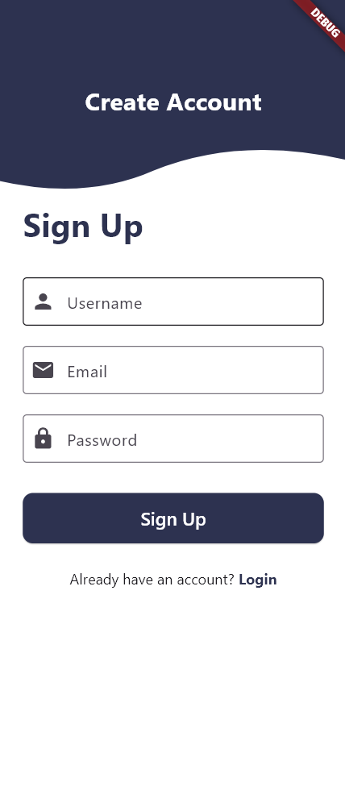
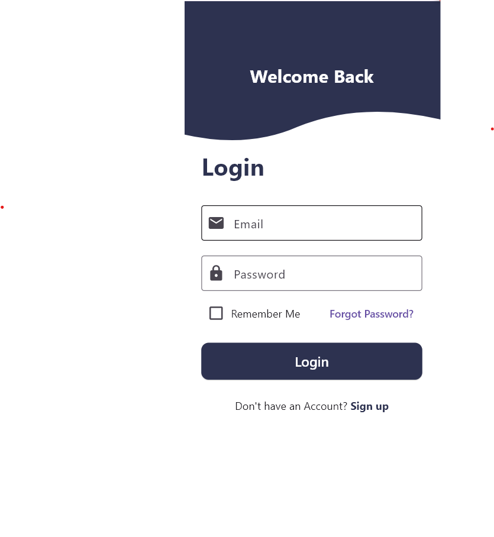
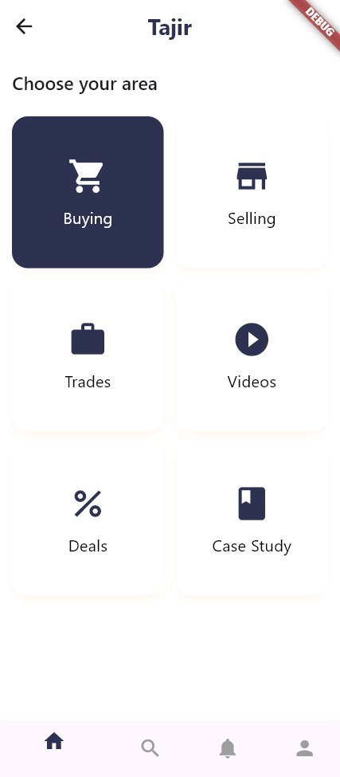

<!-- Main Title -->

  <h1 style="margin: 0; font-size: 38px;">Tajir App</h1>
  
Your trading journey starts here.

<!-- Introduction -->

  

    <strong>Tajir</strong> is a modern Flutter application with 3 essential screens:
    <em>Sign Up</em>, <em>Login</em>, and <em>Home</em>. Each screen is built to deliver a clean,
    smooth, and interactive user experience for anyone exploring online trading or e-commerce.
  

<!-- Screen Card Template -->

  <h2 style="color:#2d3250;">🔐 Sign Up Screen</h2>
  
  

    A user registration form with fields for username, email, and password.
    The wavy top design and bold button styling make this screen user-friendly and modern.
  

  <h2 style="color:#2d3250;">🔑 Login Screen</h2>
  
  

    A clean login interface with email and password input, remember me checkbox, and forgot password link.
    Transitions smoothly to the home screen after successful login.
  

  <h2 style="color:#2d3250;">🏠 Home Screen</h2>
  
  

    The dashboard displays six grid options like Buying, Selling, Trades, etc., using a beautiful layout.
    Includes bottom navigation bar with four main actions and well-styled icons.
  

